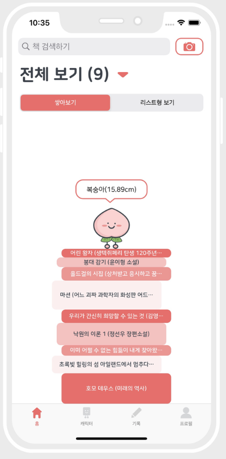

Name: Donghun (Hun) Kim

Program: Master in Design Engineering (Harvard GSD)

## Why a software engineer takes "Travel Behavior and Forecasting"

My ultimate goal as a software engineer is to use technology to **change people's habit in a desirable way** (e.g. spend more time with their family, maintain a healthy lifestyle). I have always been fascinated with applications that managed to achieve it even with the simplest technology. One example application that I think managed to achieve such goal is a Korean application named "Bookjuk Bookjuk [북적북적](https://www.studiobustles.com/)". It is an application that allows users to record book reviews of the books they have read. It uses a simple data visualization of stacked books, with each book's height defined by the number of pages in it. I am fascinated with this approach because it uses simple technology to give a sense of reward to users through visualizing the height of books the user has read, helping them continue their reading habit.

Till now, I did not have a set domain for applying technology for achieving such feat. However, I found that it might be better to stick to one topic and focus my software skills on that specific topic to achieve my goals. Since I am at GSD, I thought this is the best opportunity to learn more about urban design, and possibly create software or do research where I can find how technology can impact the habit of how people live in the urban society. Urban design itself is a big topic, and I believe there are many ways I, as a software engineer, can change the experience of urban life in a desirable way through technology.

I will visit your office from time to time during the semester to hear more of your opinions and some ways you think a software engineer could possibly help solve city problems!
